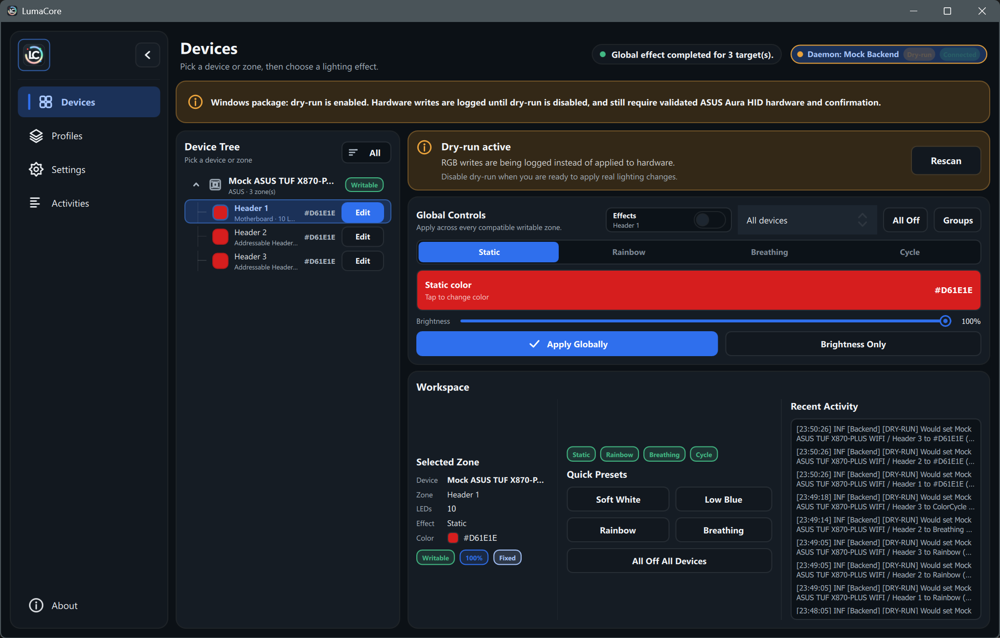
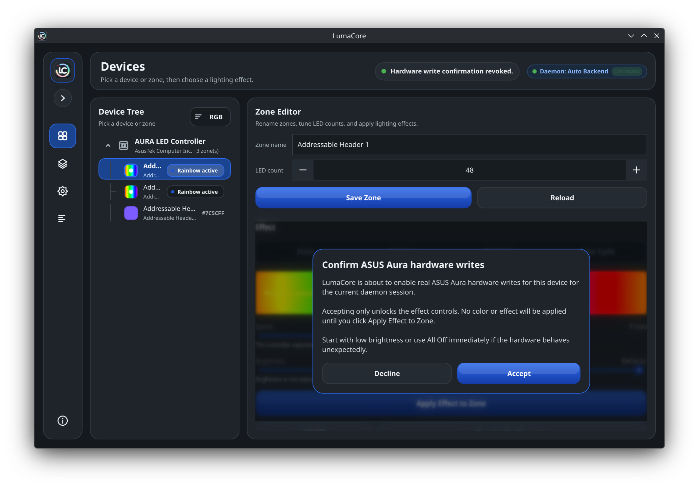
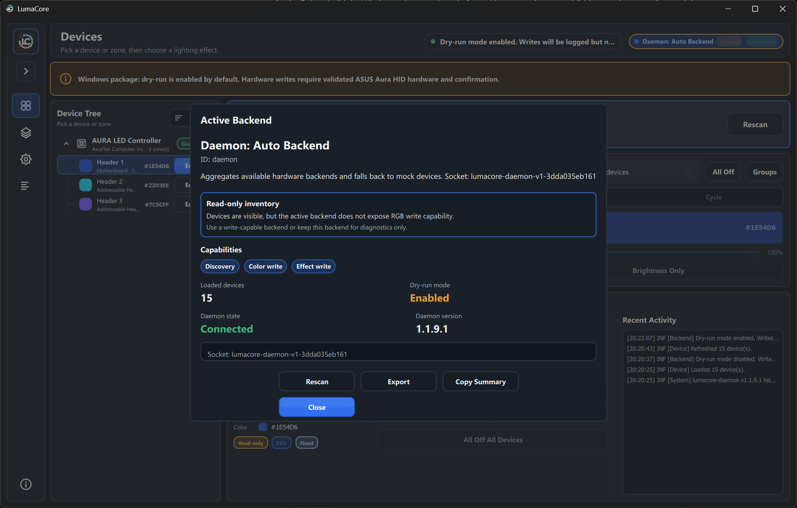

<div align="center">
  <h1>
    
    LumaCore
  </h1>

  <p>
    
    
  </p>
</div>

**v0.5.5** - Linux-first RGB control built with C++23, Qt 6, and CMake. Licensed under GPL-2.0-or-later.

LumaCore is a safe, daemon-backed RGB controller for Linux desktops. The Qt Quick GUI stays unprivileged and talks to `lumacore-daemon` over a local Unix socket; hardware-facing code runs behind backend capability checks, dry-run logging, and explicit write confirmation.







Light and collapsed-sidebar screenshots are also kept in `assets/screenshots/`.

## Current Capabilities

- Qt Quick desktop UI with a collapsible navigation rail, Devices, Profiles, Settings, Activities, backend status, and an About dialog.
- In-memory RGB model for devices, zones, LEDs, profiles, static colors, rainbow, breathing, and color-cycle effects.
- GUI-to-daemon boundary through `backends/daemon/`, `ipc/`, and `lumacore-daemon`.
- Default daemon `auto` backend that prefers verified ASUS Aura HID control, adds read-only Linux discovery inventory when available, and falls back to the mock backend.
- Mock backend with a simulated ASUS TUF X870-PLUS WIFI motherboard for UI, profile, and effect development.
- Optional Linux read-only discovery through compiled providers such as hidapi, libusb, and i2c-dev adapter metadata.
- ASUS Aura USB HID backend for the allowlisted `0B05:19AF` controller, including config-table-derived zones, static/direct color writes, native breathing/color-cycle/rainbow effects, and All Off.
- Activity log with structured severity/category entries and console mirroring.
- Backend capability dialog showing active backend, dry-run state, and supported operations.

## Safety Model

- `lumacore` refuses to run as root; `lumacore-daemon` requires root by default on Linux.
- Hardware writes are never exposed as raw packet methods to the GUI.
- Linux discovery is read-only and does not perform RGB writes.
- Dry-run mode logs write intent and backend-specific previews without applying changes.
- ASUS Aura writes require an allowlisted device, a verified `EC B0`/`EC 30` config-table response, dry-run off, approved packet builders, and per-device confirmation for the current daemon session.
- Confirmation is held in memory and is cleared when the daemon restarts or the backend is reinitialized.
- SMBus/I2C writes, generic hidraw writes, persistent hardware configuration, firmware writes, and unconfirmed ASUS writes are intentionally out of scope.

See `docs/hardware/asus-aura-hid.md` for the ASUS protocol notes, licensing boundary, and validation checklist.

## Requirements

- C++23 compiler, such as GCC or Clang
- CMake 3.24+
- Ninja or Make
- Qt 6.5+ with `Core`, `Gui`, `Network`, `Qml`, `Quick`, `QuickControls2`, and `QuickDialogs2`
- Optional for Linux discovery and ASUS Aura HID builds: `pkg-config`, `hidapi`, and/or `libusb`

On Arch-based systems:

```sh
sudo pacman -S cmake gcc qt6-base qt6-declarative hidapi libusb
```

Package names vary by distribution; install the equivalent Qt 6 development packages for yours.

## Build and Run

Configure and build from the repository root:

```sh
cmake -S . -B build
cmake --build build
```

Start the daemon, then launch the GUI from another terminal:

```sh
sudo ./build/lumacore-daemon
./build/lumacore
```

Both binaries use `/run/lumacore/lumacore.sock` by default. Override it with `--socket` when running without the packaged service setup.

For an unprivileged mock-only development session:

```sh
./build/lumacore-daemon --allow-unprivileged --backend mock --socket /tmp/lumacore.sock
./build/lumacore --socket /tmp/lumacore.sock
```

Backend overrides:

```sh
sudo ./build/lumacore-daemon --backend linux-discovery
sudo ./build/lumacore-daemon --backend asus-aura-hid
```

The daemon accepts `--backend auto`, `mock`, `linux-discovery`, or `asus-aura-hid` when those backends are built. `auto` is the default.

## CMake Options

- `LUMACORE_ENABLE_LINUX_DISCOVERY` builds daemon-only Linux read-only discovery on supported systems.
- `LUMACORE_ENABLE_HIDAPI` enables hidapi discovery when available.
- `LUMACORE_ENABLE_LIBUSB` enables libusb discovery when available.
- `LUMACORE_ENABLE_I2C_DEV` enables optional read-only i2c-dev adapter metadata discovery.
- `LUMACORE_ENABLE_ASUS_AURA_HID` builds the ASUS Aura USB HID backend with config-verified, confirmation-gated writes. It requires hidapi and Linux discovery.

## Tests

Run all configured CTest targets after building:

```sh
ctest --test-dir build --output-on-failure
```

Current tests cover the `DeviceManager` write gate path and, when the ASUS backend is built, the ASUS Aura HID protocol serializer.

## Project Layout

- `app/` - application startup, version helper, and Qt/QML wiring.
- `core/` - RGB model, effects, profiles, activity log, backend registry, permission gate, and write gate.
- `backends/mock/` - safe simulated hardware backend.
- `backends/daemon/` - GUI-facing backend that talks to `lumacore-daemon`.
- `backends/linux/` - daemon-only read-only Linux discovery backend.
- `backends/asus/` - ASUS Aura USB HID backend.
- `daemon/` - privileged daemon entry point and backend registration.
- `hardware/linux/` - Linux provider probes, HID writer, and ASUS Aura protocol helpers.
- `ipc/` - local daemon protocol, client, and server.
- `ui/` and `ui/qml/` - QML-facing controllers, models, and Qt Quick UI.
- `docs/` - daemon protocol, ASUS hardware notes, and systemd packaging notes.
- `packaging/systemd/` - example `lumacore-daemon.service`.
- `tests/` - focused unit tests.
- `assets/` - icons and screenshots.

## Profiles

Profiles are JSON files stored in `./profiles` relative to the current working directory when `lumacore` starts. Running `./build/lumacore` from the repository root writes profiles to `profiles/`, which is gitignored.

Devices match by `id`, zones match by `name`, and colors are loaded from the zone hex color field. Unknown devices or zones are skipped and invalid colors are reported in the activity log.

## Documentation

- `docs/daemon/protocol.md` documents the newline-delimited JSON socket protocol.
- `docs/hardware/asus-aura-hid.md` documents the guarded ASUS Aura HID support and protocol research boundaries.
- `docs/packaging/systemd.md` documents the example systemd service and backend overrides.

## Current Gaps

- Automated coverage is still focused; broader profile, mock-backend, UI integration, CI, sanitizers, and warning-policy work remains.
- ASUS support is intentionally limited to the allowlisted controller until more owned-hardware validation is documented.
- Profile validation is minimal.
- `startMinimized` and `applyOnLaunch` settings are persisted, but launch behavior is not fully wired yet.
- Full install targets and distribution packaging are not implemented.

## License

LumaCore is free software licensed under the GNU General Public License version 2.0 or later (`GPL-2.0-or-later`).

See `LICENSE` for the full terms.
