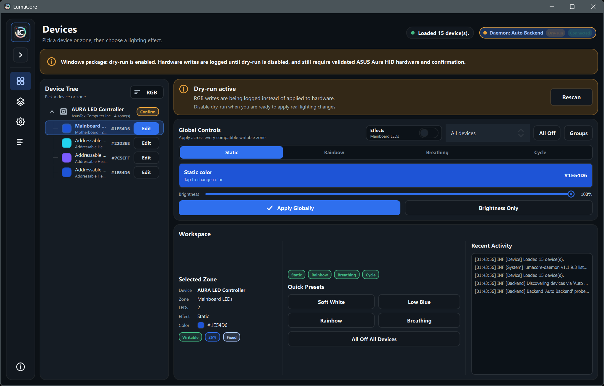

<div align="center">
  <h1>
    
    LumaCore
  </h1>

  <p>
    
    
  </p>
</div>

**v1.1.9.3** - Cross-platform, daemon-backed RGB control for Linux and Windows, with read-only hardware discovery, portable diagnostics export, safe mock testing, and guarded ASUS Aura HID writes for validated controllers. Built with C++23, Qt 6, and CMake. Licensed under GPL-2.0-or-later.

LumaCore is a safe desktop RGB controller. The Qt Quick GUI stays unprivileged and talks to `lumacore-daemon` over a local IPC endpoint; hardware-facing code runs behind backend capability checks, dry-run logging, and explicit write confirmation.

Linux uses a system-style daemon and optional systemd unit. Windows 10/11 x64 uses the same daemon architecture with a bundled sibling daemon that starts automatically from the GUI. Both platforms can use mock devices for safe testing; hardware writes remain dry-run-first and limited to validated, confirmation-gated backends.





Additional light-theme and confirmation screenshots are kept in `assets/screenshots/`.

## Current Capabilities

- Qt Quick desktop UI with a compact collapsible navigation rail, denser Devices workflow, Profiles, Settings, Activities, backend status, and an About dialog.
- Global controls for applying one effect or brightness level across all compatible zones or saved device groups, plus All Off for every writable device or a selected group, with partial-result reporting.
- In-memory RGB model for devices, zones, LEDs, profiles, static colors, rainbow, breathing, and color-cycle effects.
- GUI-to-daemon boundary through `backends/daemon/`, `ipc/`, and `lumacore-daemon`.
- Non-blocking interactive daemon requests with correlated responses, cancellation, bounded reconnect backoff, automatic device refresh, stable selection restoration, and manual Retry/Rescan controls.
- Default daemon `auto` backend that prefers verified ASUS Aura HID control, adds read-only platform discovery inventory when available, and falls back to the mock backend.
- Mock backend with a simulated ASUS TUF X870-PLUS WIFI motherboard for UI, profile, and effect development.
- Optional Linux read-only discovery through compiled providers such as hidapi, libusb, and i2c-dev adapter metadata, with cataloged RGB-controller research identities and conservative heuristic classification.
- Optional Windows read-only HID discovery through hidapi, with cataloged RGB-controller research identities and conservative heuristic classification. Windows discovery itself is inventory-only; the separate ASUS Aura HID backend owns the guarded write path.
- ASUS Aura USB HID backend for the allowlisted `0B05:19AF` controller, including config-table-derived zones, static/direct color writes, host-streamed addressable rainbow/breathing/color-cycle effects over the validated `EC40` path, and All Off.
- Profile save, load, rename, confirmed overwrite/delete, JSON import/export, compatibility reporting, partial-result summaries, and persisted active-profile selection with atomic writes and legacy color-only profile compatibility.
- Portable Auto/Light/Dark themes, animation and dry-run preferences, start-minimized and active-profile launch behavior, daily profile scheduling that runs in the daemon when supported with an in-app fallback, opt-in close-to-tray behavior, and an enabled-by-default Windows VRR flicker workaround.
- Activity log with structured severity/category entries and console mirroring.
- Backend capability dialog showing daemon connection/version details, active backend, dry-run state, supported operations, Retry/Rescan, and sanitized diagnostics export.

## Safety Model

- `lumacore` refuses to run as root; `lumacore-daemon` requires root by default on Linux.
- Hardware writes are never exposed as raw packet methods to the GUI.
- Linux and Windows discovery backends are read-only and do not perform RGB writes.
- Dry-run mode logs write intent and backend-specific previews without applying changes.
- ASUS Aura writes require an allowlisted device, a verified `EC B0`/`EC 30` config-table response, dry-run off, approved packet builders, and per-device confirmation for the current daemon session.
- Confirmation is held in memory and is cleared when the daemon restarts or the backend is reinitialized.
- SMBus/I2C writes, generic hidraw writes, persistent hardware configuration, firmware writes, and unconfirmed ASUS writes are intentionally out of scope.

See `docs/hardware/asus-aura-hid.md` for the ASUS protocol notes, licensing boundary, and validation checklist.
New hardware contributions must follow `docs/hardware/contributing-hardware.md`, which separates research notes, read-only discovery, dry-run previews, and guarded write enablement.

## Download a Release

Download the latest build from [GitHub Releases](https://github.com/KaroqDave/LumaCore/releases/latest).

- Windows users should download `LumaCore-Windows-x64.zip`.
- Linux users should download `LumaCore-Linux-x64.tar.gz`.
- Source archives are generated by GitHub and are meant for developers, not end-user testing.

## Quick Start on Windows

1. Extract `LumaCore-Windows-x64.zip` to a writable folder.
2. Double-click `lumacore.exe`.
3. Keep `lumacore-daemon.exe` beside `lumacore.exe`; the GUI starts it automatically.

The Windows package is portable. Profiles, settings, logs, and Qt cache data are stored under `data/` beside the executable. Fresh settings start in dry-run mode. To test without hardware access, open the app normally and use the mock fallback, or run the daemon manually.

Terminal 1:

```powershell
.\lumacore-daemon.exe --backend mock
```

Terminal 2:

```powershell
.\lumacore.exe --no-auto-start-daemon
```

Use Settings -> Windows diagnostics to confirm the active backend, daemon endpoint, bundled daemon status, dry-run state, Qt runtime, and profile path. ASUS Aura HID writes on Windows require the validated controller, dry-run disabled, and per-session confirmation.

## Quick Start on Linux

The Linux release archive is a staged `/usr` install tree. It is not an AppImage or distro package yet, so the target system must provide Qt 6 runtime libraries and normal Linux shared-library dependencies.

For a safe no-install mock session:

```sh
tar -xzf LumaCore-Linux-x64.tar.gz
cd LumaCore-Linux-x64
./usr/bin/lumacore-daemon --allow-unprivileged --backend mock --socket /tmp/lumacore.sock
```

In another terminal:

```sh
cd LumaCore-Linux-x64
./usr/bin/lumacore --socket /tmp/lumacore.sock
```

For an install-style test on a machine you control:

```sh
tar -xzf LumaCore-Linux-x64.tar.gz
cd LumaCore-Linux-x64
sudo cp -a usr/* /usr/
sudo systemctl daemon-reload
```

Then either run a safe mock daemon manually:

```sh
lumacore-daemon --allow-unprivileged --backend mock --socket /tmp/lumacore.sock
```

In another terminal:

```sh
lumacore --socket /tmp/lumacore.sock
```

Or use the packaged service path after creating the service group expected by the unit:

```sh
sudo groupadd --system --force lumacore
sudo systemctl enable --now lumacore-daemon.service
lumacore
```

The service uses `/run/lumacore/lumacore.sock`. Depending on your distribution policy, your user may need to be added to the `lumacore` group and then log out and back in before the GUI can access the service socket.

## Requirements

- C++23 compiler, such as GCC or Clang
- CMake 3.24+
- Ninja or Make
- Qt 6.5+ with `Core`, `Gui`, `Network`, `Qml`, `Quick`, `QuickControls2`, `QuickDialogs2`, and `Widgets`
- Optional for Linux discovery and ASUS Aura HID builds: `pkg-config`, `hidapi`, and/or `libusb`
- Optional for Windows HID discovery: a hidapi package discoverable by CMake, such as `hidapi::hidapi`, `hidapi::winapi`, or pkg-config `hidapi`; otherwise the bundled HIDAPI 0.15.0 Windows backend is used by default.

On Arch-based systems:

```sh
sudo pacman -S cmake gcc qt6-base qt6-declarative hidapi libusb
```

Package names vary by distribution; install the equivalent Qt 6 development packages for yours.

## Build From Source

Configure and build from the repository root:

```sh
cmake -S . -B build
cmake --build build
```

For a normal Linux source build, start the daemon, then launch the GUI from another terminal:

```sh
sudo ./build/lumacore-daemon
./build/lumacore
```

Both binaries use `/run/lumacore/lumacore.sock` by default. Override it with `--socket` when running without the packaged service setup.

For an unprivileged mock-only development session:

```sh
./build/lumacore-daemon --allow-unprivileged --backend mock --socket /tmp/lumacore.sock
./build/lumacore --socket /tmp/lumacore.sock
```

For a native Windows source build, use the Windows local preset described below. The GUI starts the sibling daemon automatically when both executables are in the build or package directory.

## VS Code Development

The repository includes CMake presets, clangd configuration, an `.editorconfig`, QML language-server configuration, `.vscode` tasks, and recommended VS Code extensions. Every preset exports `compile_commands.json` into its build directory, giving clangd the real Qt include paths, compiler flags, and generated headers.

The committed `.clangd` points clangd at `build-windows/`, so a configured native Windows build drives editor tooling out of the box. Open the folder, select the `windows-local` configure preset, and configure once so `build-windows/compile_commands.json` exists. When editing the Linux discovery providers from a WSL VS Code window instead, point clangd at the Linux tree by adding a local `--compile-commands-dir=build` argument (VS Code: set `clangd.arguments` in a WSL-scoped settings entry, or start clangd with that flag) after configuring the `linux-debug` preset.

The recommended extensions handle the rest: `llvm-vs-code-extensions.vscode-clangd` for C++ IntelliSense (the Microsoft C/C++ IntelliSense engine is intentionally disabled to avoid conflicts), `ms-vscode.cmake-tools` for preset-driven configure/build/test/debug, and `TheQtCompany.qt` for the QML language server. The bundled `.vscode/tasks.json` exposes **Build** (`Ctrl+Shift+B`), **Test**, **CMake: Configure**, and **QML Lint** tasks that follow whichever CMake preset is currently selected.

On Linux or in WSL, install the dependencies listed above, open the repository in the WSL VS Code window, and select the `linux-debug` configure preset:

```sh
cmake --preset linux-debug
cmake --build --preset linux-debug
ctest --preset linux-debug
```

WSL is recommended when working on Linux discovery providers because those sources are intentionally excluded from native Windows builds. Native Windows builds include the Windows read-only HID discovery path and can build the guarded ASUS Aura HID backend when hidapi is available.

For a Qt Online Installer setup on Windows, copy `CMakeUserPresets.json.example` to the ignored `CMakeUserPresets.json`, update `QT_ROOT_DIR` and `MINGW_ROOT`, and select the resulting `windows-local` preset in CMake Tools:

```powershell
Copy-Item CMakeUserPresets.json.example CMakeUserPresets.json
cmake --preset windows-local
cmake --build --preset windows-local
ctest --preset windows-local
```

The local preset adds Qt and MinGW to the build environment so clangd can query the compiler for its target and standard-library include paths.

Use the release preset for portable Windows packages:

```powershell
cmake --preset windows-local-release
cmake --build --preset windows-local-release
ctest --preset windows-local-release
.\packaging\windows\package.ps1 -BuildDir .\build-windows-release
```

On Windows, launching `lumacore.exe` automatically starts the sibling `lumacore-daemon.exe` with the `auto` backend. It uses read-only HID discovery when compiled with hidapi, can use guarded ASUS Aura HID writes for validated controllers, and falls back to mock devices otherwise. Pass `--no-auto-start-daemon` to disable automatic daemon startup. The default local endpoint is a versioned, per-user name beginning with `lumacore-daemon-v1-`.

See [docs/windows-preview.md](docs/windows-preview.md) for Windows package behavior and limitations.

Build and stage Linux release artifacts with:

```sh
cmake -S . -B build-linux-release -G Ninja -DCMAKE_BUILD_TYPE=Release
cmake --build build-linux-release
ctest --test-dir build-linux-release --output-on-failure
cmake --build build-linux-release --target all_qmllint
DESTDIR="$PWD/dist/linux-stage" cmake --install build-linux-release --prefix /usr
```

The install target stages `lumacore`, `lumacore-daemon`, the desktop entry, hicolor icons, and the configured systemd unit. Package post-install scripts should create the `lumacore` group when group-based daemon socket access is desired, then reload systemd and enable/start `lumacore-daemon.service` according to the distribution's policy.

Run the same QML analysis enforced by CI with:

```sh
cmake --build build --target all_qmllint
```

The native Windows preset configures into `build-windows/` while the Linux/WSL presets use `build/`, so the same checkout can hold both platform build trees at once without reconfiguring or deleting either. clangd reads `build/compile_commands.json`, so the Linux/WSL tree drives editor tooling.

Backend overrides:

```sh
sudo ./build/lumacore-daemon --backend linux-discovery
sudo ./build/lumacore-daemon --backend asus-aura-hid
```

The daemon accepts `--backend auto`, `mock`, `linux-discovery`, `windows-discovery`, or `asus-aura-hid` when those backends are built. `auto` is the default.

## CMake Options

- `LUMACORE_ENABLE_LINUX_DISCOVERY` builds daemon-only Linux read-only discovery on supported systems.
- `LUMACORE_ENABLE_WINDOWS_DISCOVERY` builds daemon-only Windows read-only HID discovery on supported systems.
- `LUMACORE_ENABLE_HIDAPI` enables hidapi discovery when available.
- `LUMACORE_USE_BUNDLED_HIDAPI` uses the vendored HIDAPI Windows backend when no system hidapi package is found. It defaults to `ON` for Windows and `OFF` elsewhere.
- `LUMACORE_ENABLE_LIBUSB` enables libusb discovery when available.
- `LUMACORE_ENABLE_I2C_DEV` enables optional read-only i2c-dev adapter metadata discovery.
- `LUMACORE_ENABLE_ASUS_AURA_HID` builds the ASUS Aura USB HID backend with config-verified, confirmation-gated writes on supported Linux and Windows builds when hidapi is available. It uses the platform HID discovery and writer transport.
- `LUMACORE_ENABLE_WARNINGS` enables project compiler warnings for first-party targets.
- `LUMACORE_WARNINGS_AS_ERRORS` treats project compiler warnings as errors.
- `LUMACORE_ENABLE_SANITIZERS` enables AddressSanitizer and UndefinedBehaviorSanitizer for supported GNU/Clang Linux builds.
- `LUMACORE_INSTALL_SYSTEMD_UNIT` controls whether Linux installs stage the systemd unit.
- `LUMACORE_SYSTEMD_UNIT_DIR` overrides the systemd unit install destination.

## Tests

Run all configured CTest targets after building:

```sh
ctest --test-dir build --output-on-failure
```

Run the Linux sanitizer configuration on Linux or WSL:

```sh
cmake --preset linux-sanitizer
cmake --build --preset linux-sanitizer
ctest --preset linux-sanitizer
```

Current tests cover write confirmation and gating, profile persistence, profile apply/preview
reports, daemon frame limits and snapshots, auto-backend deduplication, option parsing, schedule
settings, application controllers, daemon launch behavior, a full-stack end-to-end flow that
launches the real daemon with the mock backend and drives handshake, inventory, dry-run
effect/frame writes, the dry-run synchronization guard, All Off, and idle shutdown over the local
socket, a headless QML smoke test that loads the full interface through the GUI's `--self-test`
path and fails on any QML load or binding warning, global and group effect/brightness/All Off
capability gating and partial-result reporting across mixed-support and confirmation-gated devices,
and, when the ASUS backend is built, the ASUS Aura HID configuration parser and protocol
serializer.

## Project Layout

- `app/` - application startup, version helper, and Qt/QML wiring.
- `core/` - RGB model, effects, profile storage and planning, schedule-time parsing, activity log, backend registry, permission gate, and write gate.
- `backends/auto/` - daemon-side hardware/discovery aggregation with mock fallback.
- `backends/mock/` - safe simulated hardware backend.
- `backends/daemon/` - GUI-facing backend that talks to `lumacore-daemon`.
- `backends/linux/` - daemon-only read-only Linux discovery backend.
- `backends/windows/` - daemon-only read-only Windows HID discovery backend.
- `backends/asus/` - ASUS Aura USB HID backend.
- `daemon/` - privileged daemon entry point and backend registration.
- `hardware/common/` - cross-platform discovery catalog helpers.
- `hardware/asus/` - shared ASUS Aura HID protocol serializers.
- `hardware/linux/` - Linux provider probes and HID writer.
- `hardware/windows/` - Windows HID provider probes and HID writer.
- `ipc/` - local daemon protocol, shared frame codec, client, and server.
- `ui/` and `ui/qml/` - QML-facing controllers, models, private UI preference stores, and Qt Quick UI.
- `docs/` - architecture, daemon protocol, refactor parity, release verification, release package notes, hardware notes, and Linux systemd packaging notes.
- `packaging/` - desktop entry, systemd unit template, and Windows package script.
- `tests/` - focused unit tests.
- `assets/` - icons and screenshots. After editing `assets/icons/lumacore.svg`, run `python scripts/generate-icons.py` (requires PySide6 and Pillow).

## Profiles

Profiles are JSON files stored under LumaCore's application data root. Portable and local builds use `data/profiles` beside the running executable; installed Linux builds use the platform data location for the GUI and `/var/lib/lumacore` for the root daemon service. App settings and Qt/QML caches live under the same root, so the Windows package does not write registry settings or AppData state for normal operation. On first use, LumaCore migrates JSON profiles from the legacy `./profiles` directory when the new directory does not yet exist. Saves use `QSaveFile` for atomic replacement.

Devices match by `id`; zones match by `name` with their stored index as a fallback. Profiles restore zone names, LED counts, colors, effect types, speed, and brightness. Legacy color-only zones still load. Unknown devices or zones are skipped, invalid colors are reported in the activity log, and a profile that matches no available zones is rejected. Synchronous startup/scheduled applies and asynchronous interactive applies share the same internal profile planner so report keys, skip counts, details, and preview item shapes stay aligned.

## Documentation

- `docs/daemon/protocol.md` documents the newline-delimited JSON socket protocol.
- `docs/architecture.md` documents runtime boundaries and stable APIs.
- `docs/refactor-parity.md` is the behavior-preservation checklist for structural changes.
- `docs/release-verification.md` documents repeatable build, test, lint, sanitizer, package-staging, and release-asset checks.
- `docs/linux-package.md` documents Linux release archive contents, safe mock testing, and install-style testing.
- `docs/windows-preview.md` documents Windows package behavior and limitations.
- `docs/hardware/asus-aura-hid.md` documents the guarded ASUS Aura HID support and protocol research boundaries.
- `docs/hardware/discovery-catalog.md` documents read-only discovery classification stages and cataloged research identities.
- `docs/hardware/contributing-hardware.md` documents the staged workflow and PR checklist for new hardware support.
- `docs/packaging/systemd.md` documents Linux install staging, the systemd service, and backend overrides.

Device wire protocols are reverse-engineered and verified against owned hardware with
[**LumaScope**](https://github.com/KaroqDave/LumaScope), a companion capture/decode harness.
LumaScope drives the vendor app, captures the USB traffic (Frida hooks or a USBPcap bus sniff), and
auto-diffs it into a protocol spec - the loop that confirmed LumaCore's ASUS Aura `EC40` direct-color
packets byte-for-byte against a real board, established that Armoury Crate host-streams every effect
(no native `EC35`/`EC36` command is used), and measured that effect speed is a host animation rate
rather than a wire field (see `docs/hardware/asus-aura-hid.md`).

## Current Gaps

- Automated coverage is still focused; a full-stack daemon end-to-end test, a headless QML load smoke test, and global/group partial-result reporting tests now exercise the mock-backed socket flow, the interface's initial render, and heterogeneous-device operation reporting, but interaction-level QML/UI coverage remains beyond the current CTest, QML lint, warning, sanitizer, and package-staging checks.
- Profile scheduling runs in the daemon when it advertises schedule support, so schedules fire while the GUI is closed on a persistent (systemd) daemon; against an older daemon the GUI falls back to session-only scheduling, and an older GUI paired with a newer daemon that holds a previously pushed schedule fires it daemon-side once per day.
- ASUS support is intentionally limited to the allowlisted controller until more owned-hardware validation follows the hardware contribution workflow.
- Profile validation is minimal.
- Native installers and Linux distribution packages are not implemented; releases currently provide a Windows portable ZIP and a Linux x64 staged install tarball.

## License

LumaCore is free software licensed under the GNU General Public License version 2.0 or later (`GPL-2.0-or-later`).

See `LICENSE` for the full terms.
